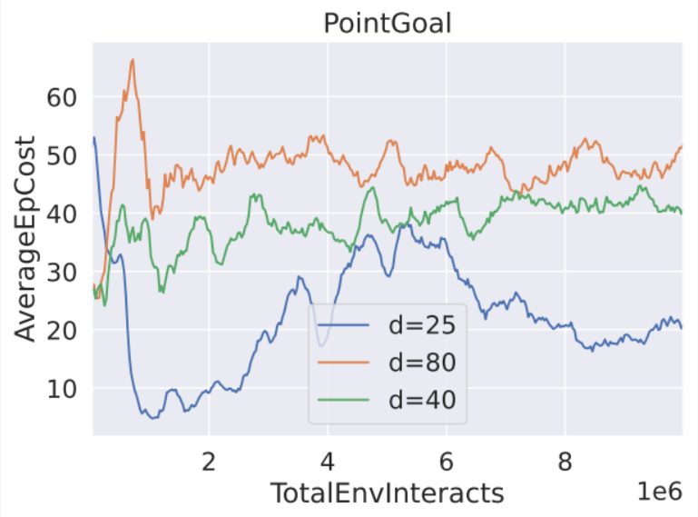
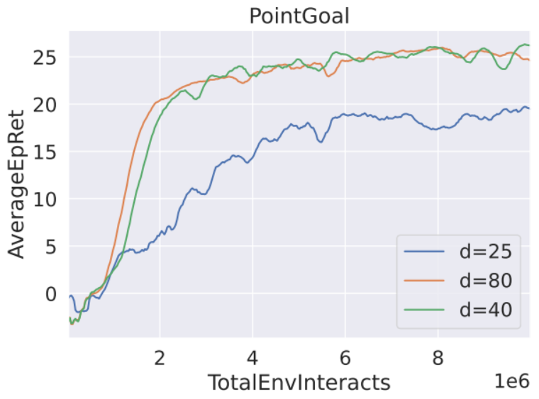
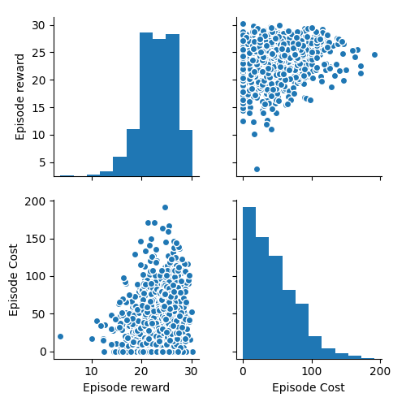
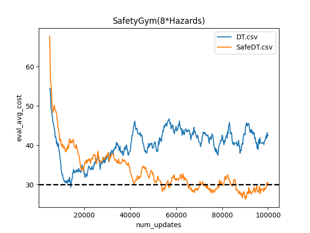
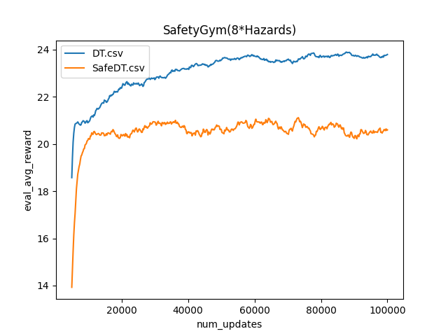
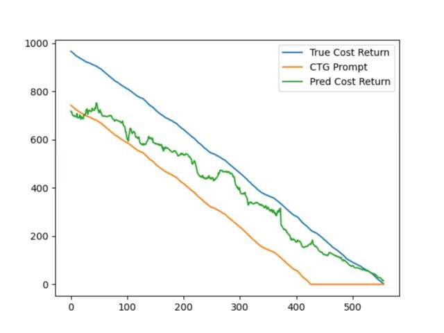
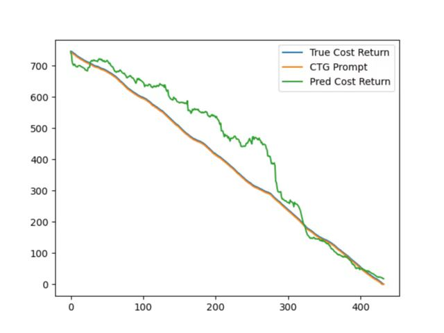

# 1.Additional experiments.

## 1.1 experiments on SafetyGym

Here is an introduction to the experiments we conducted on SafetyGym:

Firstly, as there is no open-source offline dataset available on SafetyGym, we created our own offline safety dataset based on the PointGoal environment. To construct this dataset, we trained the PPO-lag algorithm with different constraint thresholds and generated trajectories using the trained models. Specifically, we used constraint thresholds of 25, 40, and 80 with the PPO-lag algorithm, and the final cost and reward performance of these models are shown in the following figure.

  

We then saved these three models and generated 333/334 trajectories for each model, resulting in a total of 1000 offline trajectory data that composed our PointGoal dataset. The distribution of this dataset is shown in figure below, which demonstrates that our dataset still has a certain degree of distinguishability.

After generating the dataset, we tested our model and used a DT model as a baseline, setting the constraint threshold to d=30. The experimental results, shown in Figure below, demonstrate that our model can still meet the constraint requirements in the SafetyGym environment. This experiment showcases the potential of our model for safety-critical applications on SafetyGym.

   

## 1.2 experiments comparation with CoptiDICE

<table>
    <tr>
        <th colspan='2'>DATASET</th><th>SAFORMER</th><th>CoptiDICE</th>
    </tr>
    <tr>
        <td rowspan="3">HALFCHEETAH_MEDIUM</td><td>REWARD</td><td>4661.20 ± 52.46</td><td><b>4847 ± 50 </b></td>
    </tr>
    <tr>
        <td>COST</td><td>4487.2 ± 6.05</td><td><b>4335 ± 23</b></td>
    </tr>
    <tr>
        <td>LIMIT</td><td>4490</td><td>4490</td>
    </tr>
    <tr>
        <td rowspan="3">HALFCHEETAH_MEDIUM_REPLAY</td><td>REWARD</td><td><b>3019.17 ± 234.09</b></td><td>3314±188</td>
    </tr>
    <tr>
        <td>COST</td><td><b>4289.54 ± 6.31</b></td><td>4412±64</td>
    </tr>
    <tr>
        <td>LIMIT</td><td>4300</td><td>4300</td>
    </tr>
    <tr>
        <td rowspan="3">HALFCHEETAH_MEDIUM_EXPERT</td><td>REWARD</td><td><b>11000.37 ± 141.93</b></td><td>482 ± 149</td>
    </tr>
    <tr>
        <td>COST</td><td><b>4296.87 ± 9.92</b></td><td>3141 ± 125 </td>
    </tr>
    <tr>
        <td>LIMIT</td><td>4300</td><td>4300</td>
    </tr>
</table>

Here, we compared our method with CoptiDICE. Specifically, we conducted experiments with CoptiDICE on three datasets of halfcheetah, and the results are shown in the following figure. The results demonstrate that our method outperforms CoptiDICE in halfcheetah_medium_replay and halfcheetah_meidum_expert tasks,proved the effectiveness of our model.

In particular, we need to note that Halfcheetah_medium_expert is a more challenging dataset and learning the expert policy on this dataset is a relatively difficult task. On this task, Saformer demonstrated outstanding performance, while CoptiDICE failed. We believe that the reason for Saformer's poor performance on the Halfcheetah_medium task is that the distribution of $\hat C$ and $\hat R$ in this dataset is too narrow (see Appendix A of the paper), which prevented our model from achieving the best performance.

## 1.3 Hyperparameter Analysis 

**1.  subsequence length $K$**

<!-- 在这部分，我们对Transformer的上下文长度K进行超参数实验，在Halfcheetah_medium数据集的20%分位点进行实验，采用这个数据集是因为Halfcheetah数据集与Hopper与Walker2d的轨迹非定长不同，其数据集的长度是固定的，更有利于我们开展超参数K的实验，我们确定K的大小为[2,5,10,20,40]并进行实验，实验结果如下图，我们发现K取除了40之外的所有值，Saformer都可以满足我们的约束设置，证明了Saformer对超参数K的鲁棒性。 -->
<table>
    <tr>
        <th colspan='2'>Model</th><th>K=2</th><th>K=5</th><th>K=10</th><th>K=20</th><th>K=40</th>
    </tr>
    <tr>
        <td rowspan="3">Saformer</td><td>REWARD</td><td>4555 ± 117</td><td>4601 ± 120 </td><td>4632 ±94</td><td>4713 ± 26 </td><td>4728 ±75</td>
    </tr>
    <tr>
    <td>COST</td><td>4474 ± 17</td><td>4476 ± 23</td><td>4479 ± 20</td><td>4498 ± 2 </td><td>4506 ± 12</td> 
    </tr>
    <tr>
        <td>LIMIT</td><td>4503</td><td>4503</td><td>4503</td><td>4503</td><td>4503</td>
    </tr>
</table>

In this section, we conducted hyperparameter experiments on the context length K of Transformer, using the 20th percentile of the Halfcheetah_medium dataset. We chose this dataset because the trajectories in the Halfcheetah dataset are of fixed length, unlike Hopper and Walker2d, which have variable-length trajectories, which makes it more conducive to our experiments on the hyperparameter K. We selected K values of [2, 5, 10, 20, 40] and conducted experiments, as shown in the figure below. We found that for all values of K except 40, Saformer can satisfy our constraint settings, which demonstrates the robustness of Saformer to the hyperparameter K.

**2.   penalty factor $\lambda$.**

<!-- 在这部分，我们对Critic的正则化项参数$\lambda$进行超参数实验，$\lambda$控制的是Critic对预测的CTG的非递减性的损失权重，为了便于统一，我们同样使用Halfcheetah_medium数据集的20\%分位点进行实验。我们确定 $\lambda$ 的大小为[0,0.25,0.5,1.0,2.0]进行实验，实验结果显示改变$\lambda$会对整个轨迹的约束满足情况造成一定的影响，但在$\lambda$处于(0,1)时整体效果并没有相差很多，证明了Saformer对正则化项$\lambda$的鲁棒性。 -->

<table>
    <tr>
        <th colspan='2'>Model</th><th> λ=0</th><th>λ=0.25</th><th>λ=0.5</th><th>λ=1.0</th><th>λ=2.0</th>
    </tr>
    <tr>
        <td rowspan="3">Saformer</td>
    <td>REWARD</td><td>4578±100</td><td>4683±67 </td><td>4574±178</td><td>4620±79 </td><td>4599±37</td>
    </tr>
    <tr>
    <td>COST</td><td>4459±23</td><td>4491±14</td><td>4471±40</td><td>4487±15 </td><td>4478±47</td> 
    </tr>
    <tr>
        <td>LIMIT</td><td>4503</td><td>4503</td><td>4503</td><td>4503</td><td>4503</td>
    </tr>
</table>

In this section, we conducted hyperparameter experiments on the regularization parameter $\lambda$ of the Critic, which controls the weight of the non-decreasing loss of the predicted CTG by the Critic. To ensure consistency, we also used the 20% percentile of the Halfcheetah_medium dataset for experimentation. We determined the values of $\lambda$ as [0,0.25,0.5,1.0,2.0] and conducted experiments. The results showed that changing $\lambda$ had some impact on the satisfaction of the constraints for the entire trajectory, but the overall performance did not differ much when $\lambda$ was between (0,1), demonstrating the robustness of Saformer to the regularization parameter $\lambda$.

# 2.Effectiveness of the Posterior Safety Verification

In this section, we will verify the effectiveness of the posterior safety verification module in Saformer.

First, let me describe the two figures below. In these two figures, the blue line represents the actual cost obtained by the agent when backtracking each time step after completing the entire trajectory, the yellow line represents the CTG_prompt value designed by us for the agent, and the green line represents the CTG value predicted by the Saformer critic module. After explaining the meaning of each line, we can draw the following assumptions:

(1) If the blue line is lower than the yellow line at time step 0, it means that the total cost of the entire trajectory is lower than the constraint threshold we set, that is, the entire trajectory meets the constraint condition.

(2) We expect the blue line to be slightly lower than the yellow line, but not too low. If the blue line is lower than the yellow line, it indicates that the trajectory meets the safety constraint condition, as stated in (1); however, we do not want the blue line to be too low. This is because our research assumes that there is a weak linear correlation between the agent's rewards and constraints, and a very low blue line can lead to worse reward effects.

With the above assumptions in mind, we can analyze the images as follows:

Left : We only train the Saformer Critic without using it to modify the actions of the Saformer Actor. In this part, we can observe that the average value of the blue line is higher than that of the yellow line, indicating that our policy cannot satisfy the safety constraint. The reason is that although Saformer Critic can predict that an action is dangerous at a certain time step (when the green line is above the yellow line, i.e., $\hat C > CTG$), it cannot modify the action, resulting in a trajectory that does not satisfy the safety constraint.

Right : We train the Critic and use it to modify the actions. At this point, we can see that the blue line is very close to the yellow line, indicating that the Saformer with the Critic modification can find the most appropriate action to satisfy the safety constraint.

Through the above analysis and experiments, we conclude that our Critic module is reasonable and effective.
